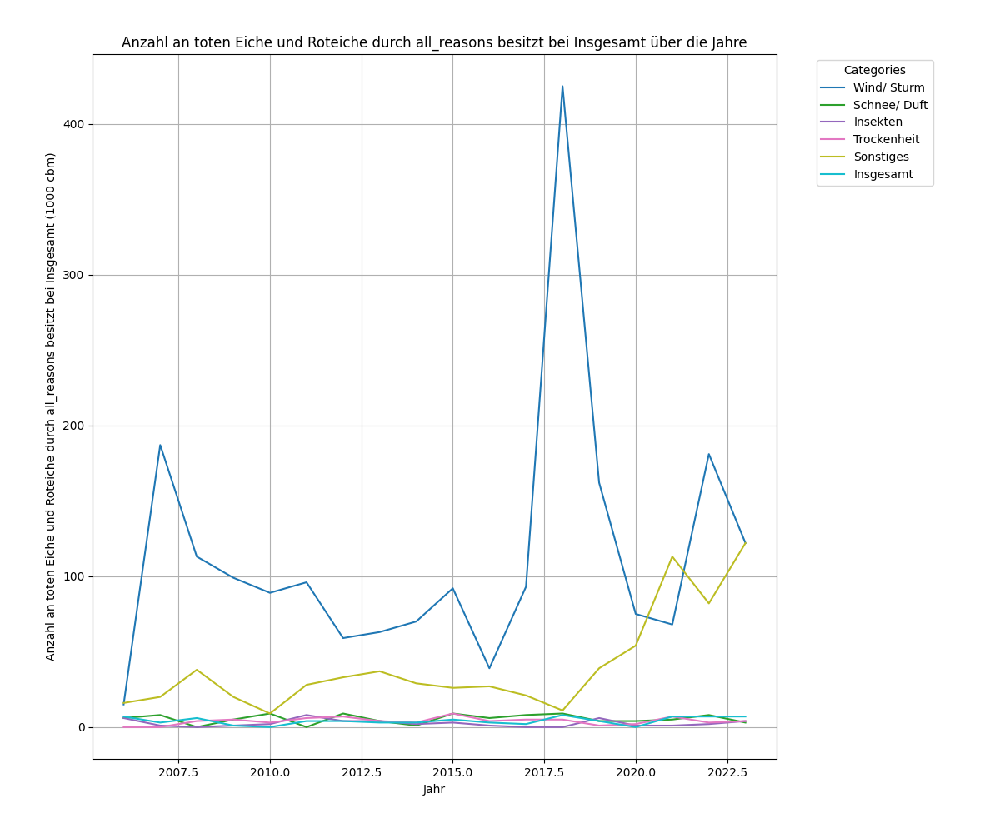
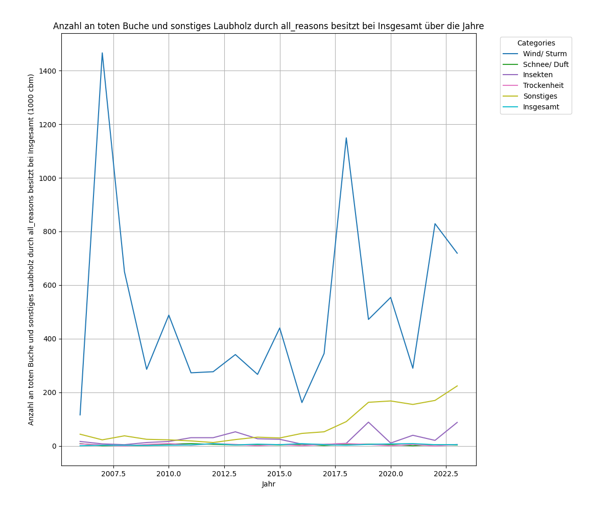
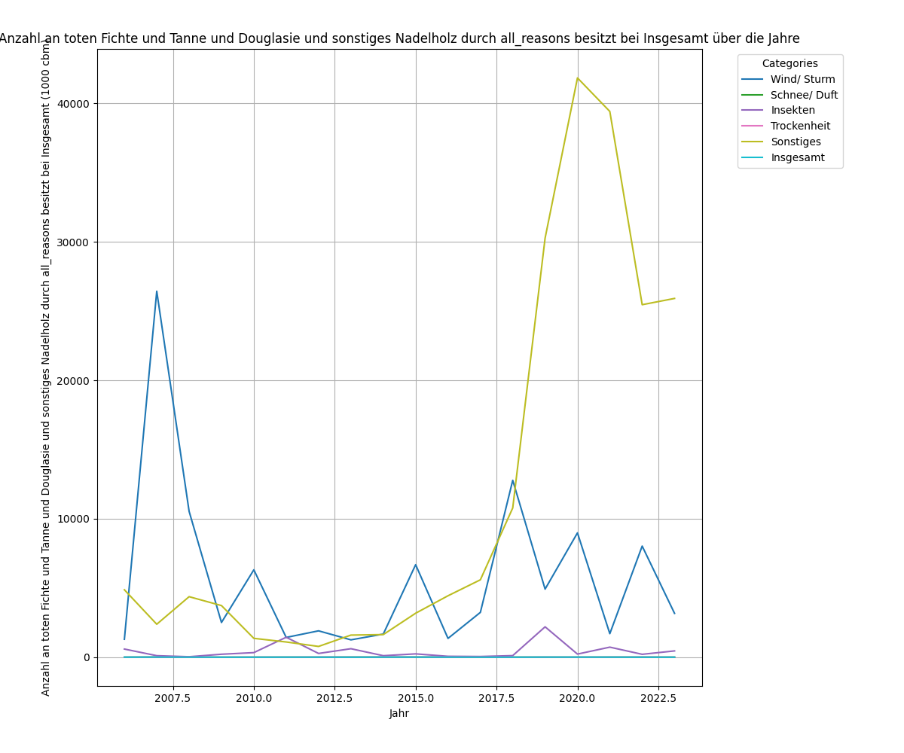
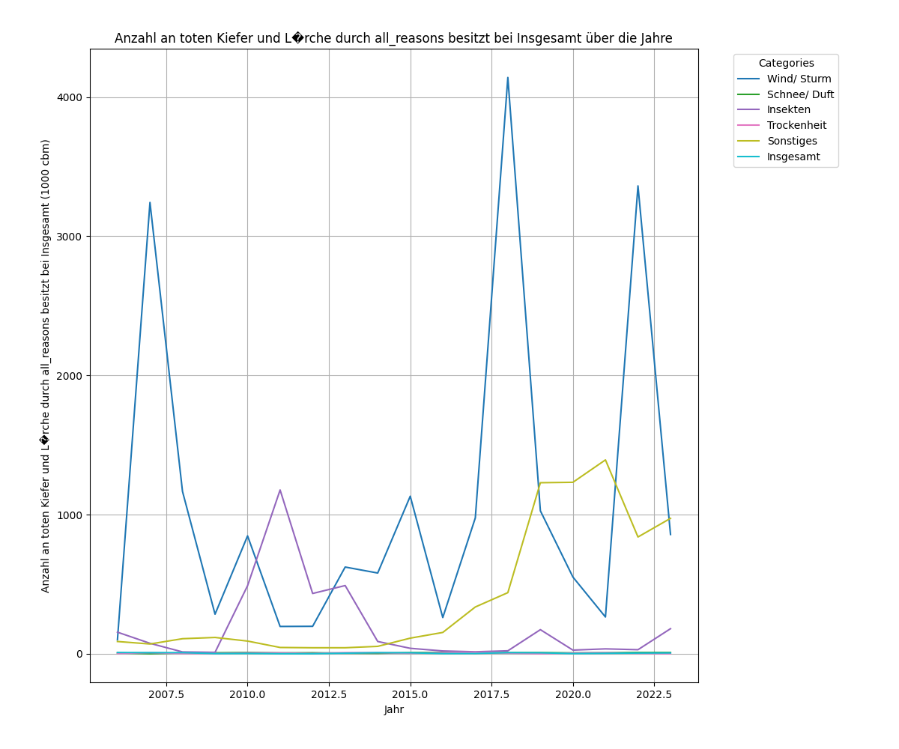
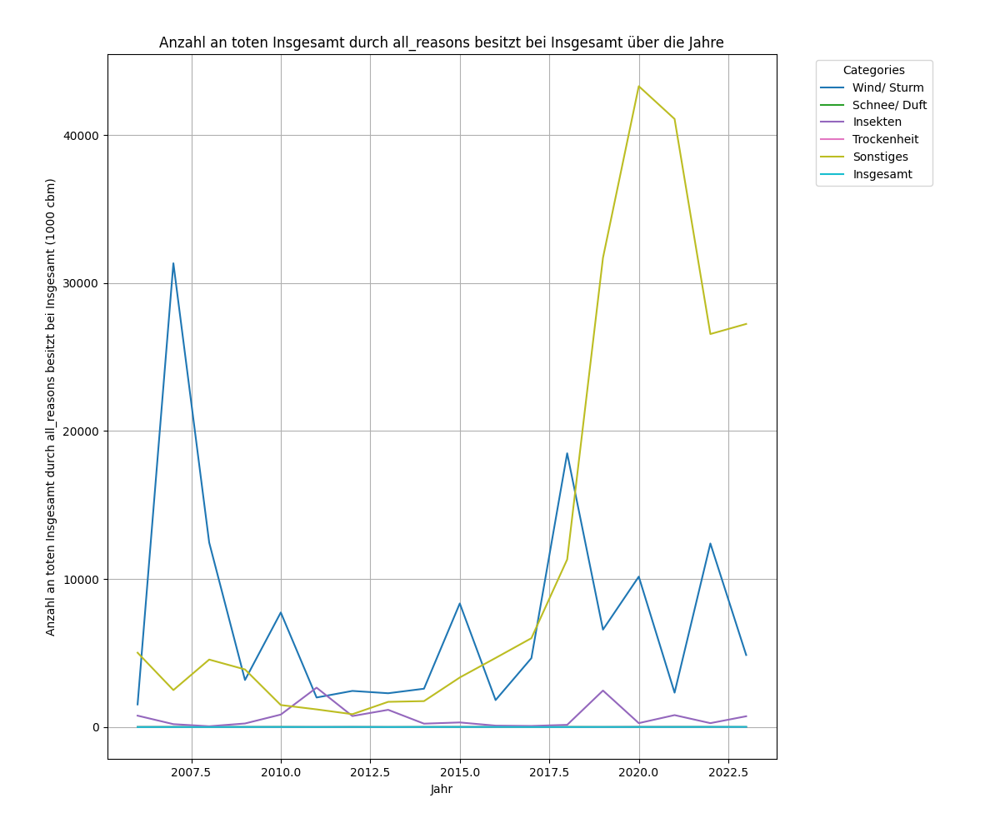

# DamagedLoggingAnalyzer


A project about of analyzing a statistic of damaged logging (wood) in Germany using Python.

This my individual project for the module **Research Software Engineering** in SS24.

# Damaged Logging

## What is the dataset about?

The dataset contains statistics on forest wood harvesting due to various damages in Germany,
listed by year, type of wood species groups, and ownership types of forests. 

Each entry specifies the volume of wood harvested (in cubic meters) due to different causes
such as wind/storm, snow/ice damage, insects, drought, and other reasons.

## Why is this dataset interesting?

Here are some interesting aspects and potential questions, which could explore using this data:

**Temporal Trends**: 
How has the damage-caused wood harvesting changed over the years? 
Are there increasing trends in certain types of damage like drought or insects, possibly linked to climate change?

**Damage Types**: 
Which type of damage causes the most wood harvesting? 
How do different regions or types of forests compare in their vulnerability to specific damage types?

**Forest Management**: 
Are there noticeable differences in wood harvesting due to damage across different forest ownership types 
(e.g., state-owned vs. privately-owned forests)? This could reflect different management practices and their effectiveness.

**Impact of Extreme Weather**: 
Are there particular years with exceptionally high damage that could be correlated to extreme weather events or climate anomalies?

**Preventive Measures**: 
Can we identify patterns or correlations that suggest effective preventive or mitigation strategies against certain types of damage?

**Economic and Ecological Impact**: 
What might be the economic impact of these losses? 
How might these harvesting activities due to damages impact the ecological balance and biodiversity in these forests?

## Temporal Trends
**Question**:
How has the damage-caused wood harvesting changed over the years? 

I created individual plots for the total volume of wood harvested due to different reasons (drought, wind/storm, snow, insects, miscellaneous, total) over the years for different types of wood species.
And additionally, I created combined plots for the different types of wood species.
**Note:** In the following, I will only show the combined plots for the different types of wood species. The other plots can be found in the `plots` directory or can be generated with the following command:

```bash
damaged_logg_analyzer statistic/DamagedLoggingWoodFixTable.csv --temporal-dependencies --out-dir path/to/output
```

Total Oak and Red Oak deaths over the years in Germany:



Total Beech and Hardwood deaths over the years in Germany:


Total Spruce deaths over the years in Germany:



Total Pine deaths over the years in Germany:



**Warning**: The dataset value for 'Insgesamt' seams incorrect.
Total tree deaths over the years in Germany:



Are there increasing trends in certain types of damage like drought or insects, possibly linked to climate change?

# Usage

## Commandline

```bash
usage: damaged_logg_analyzer [-h] [--version] [--temporal-dependencies] [--out-dir OUT_DIR] CSV

Analyzes the data about damaged wood from the CSV file.

positional arguments:
  CSV                   Path to the CSV containing the statistic.

options:
  -h, --help            show this help message and exit
  --version             show program's version number and exit
  --temporal-dependencies
                        Create plots for temporal dependencies.
  --out-dir OUT_DIR     Output directory for the plots.
```

## Library

```python
from damagedlogginganalyzer.DamagedLoggingAnalyzer import DamagedLoggingAnalyzer
from damagedlogginganalyzer.CSVAnalyzer import CSVAnalyzer
```

# Statistic about Damaged Logging

From: [genesis.destatis](https://www-genesis.destatis.de/genesis/online?operation=abruftabelleBearbeiten&levelindex=1&levelid=1713202276894&auswahloperation=abruftabelleAuspraegungAuswaehlen&auswahlverzeichnis=ordnungsstruktur&auswahlziel=werteabruf&code=41261-0003&auswahltext=&werteabruf=starten)

Statistic Number: 41261-0003